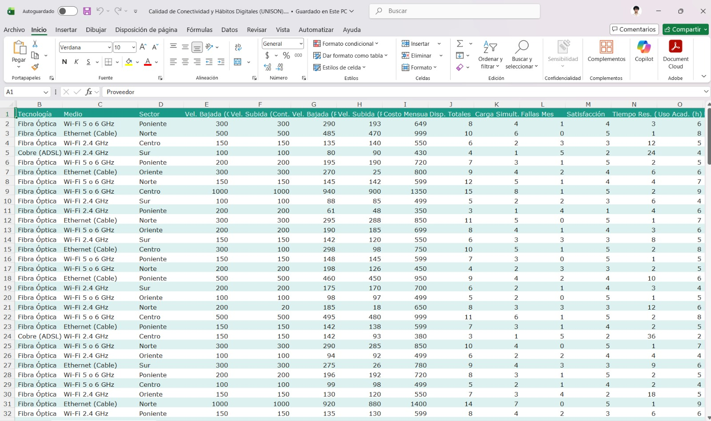

# Análisis de Calidad de Conectividad y Hábitos Digitales

> **ES:** Estudio empírico con 184 estudiantes sobre conectividad doméstica y hábitos digitales.
> **EN:** An empirical study with 184 students on home connectivity and digital habits.

---

## Español

### Descripción

Estudio empírico con **184 estudiantes de Ciencias de la Computación** de la Universidad de Sonora
(campus Hermosillo). El objetivo fue medir la diferencia entre las velocidades de internet prometidas
por los proveedores y el rendimiento real, y explicar qué variables inciden en ella.

Los datos se recolectaron con una encuesta en Microsoft Forms (variables cuantitativas y cualitativas,
escala Likert) y se procesaron con Excel y Python. Se aplicaron estadística descriptiva, pruebas de
hipótesis Z y modelos de regresión lineal.

### Integrantes (creadores)

- Ibarra Padilla Sebastián
- López Corella David Antonio
- Martínez Ruiz Josué Ignacio
- Ortega Molina Marco Sebastián
- Pérez Cáñez Santiago

**Materia:** Análisis de Datos I · **Universidad de Sonora**

### Tecnologías

- Python (Pandas, NumPy, SciPy, Matplotlib, Seaborn)
- Excel

### Contenido

- `images/` — gráficas y resultados del análisis.
- `docs/Trabajo-Extenso-Analisis-Datos-I.pdf` — reporte extenso.
- `docs/Resumen-Ejecutivo-Analisis-Datos-I.pdf` — resumen ejecutivo.

---

## English

### Description

An empirical study with **184 Computer Science students** at the University of Sonora (Hermosillo
campus). The goal was to measure the gap between the internet speeds promised by providers and the
real performance, and to explain which variables drive it.

Data was collected with a Microsoft Forms survey (quantitative and qualitative variables, Likert
scale) and processed with Excel and Python. Descriptive statistics, Z hypothesis testing, and linear
regression models were applied.

### Authors (creators)

- Ibarra Padilla Sebastián
- López Corella David Antonio
- Martínez Ruiz Josué Ignacio
- Ortega Molina Marco Sebastián
- Pérez Cáñez Santiago

**Course:** Data Analysis I · **University of Sonora**

### Tech

- Python (Pandas, NumPy, SciPy, Matplotlib, Seaborn)
- Excel

### Contents

- `images/` — charts and analysis results.
- `docs/Trabajo-Extenso-Analisis-Datos-I.pdf` — extended report.
- `docs/Resumen-Ejecutivo-Analisis-Datos-I.pdf` — executive summary.
